(\*This is an esoteric post\*)

Currently, the weather in Gandhinagar, Gujarat is too hot, and ACs are not yer switched on in college hostels. As a result, often, the temperature of outside air is much cooler around evening (post 7 pm) as compared to the situation inside the room. Since we do not want to be literally cooked, We often keep the door open. However cross air-flow from the windows (which are opposite to the door) into the corridor, results in a loud banging of the the door getting shut. Hence we required a good and easy door stopper, whihc is non intrusive, and easy to latch or unlatch. Hence this post will serve as a very small guide to make a custom door stopper.

# Prerequisites:

Many readers, might stop reading after this, primarily because it is a very specific set of prerequisites. Failing one of them would not allow you to proceed with the guide.

Firstly, you need an anchor, to which your door-stopper will attach, in our room, we have an almirah which is not frequently used, so we will use it's handle as our anchor. Then, the door (which is to be stopped), has to be near the said anchor. When the door is opened, the configuration of the door-anchor pair, has to be such that its handle comes into close proximity to the anchor. 

> THe red line shows the trajectory of the door.

| | |
|-- |-- |
| 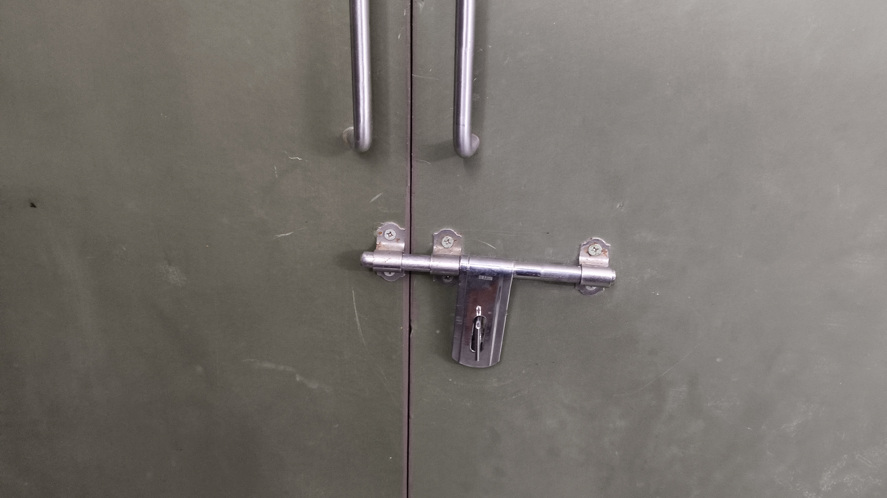 | 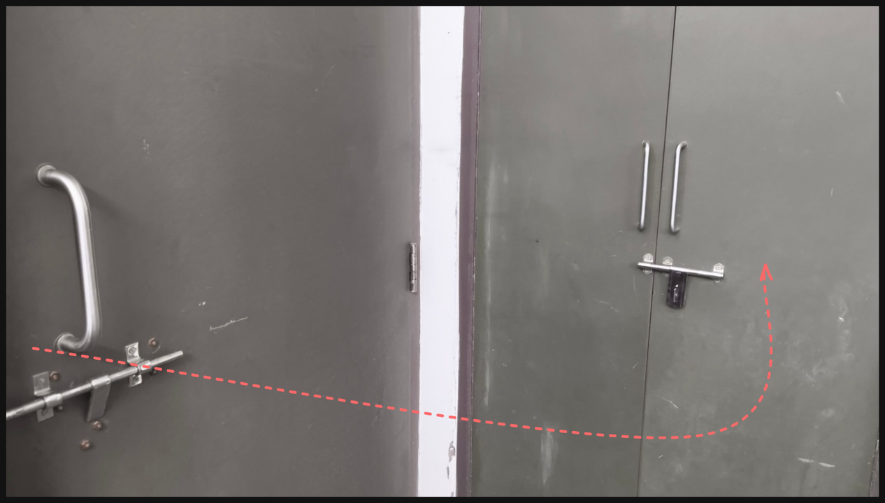 |

Next you require a metal handle, which is easy to unwind/realign using your hands (we do not have a pliers in our room).

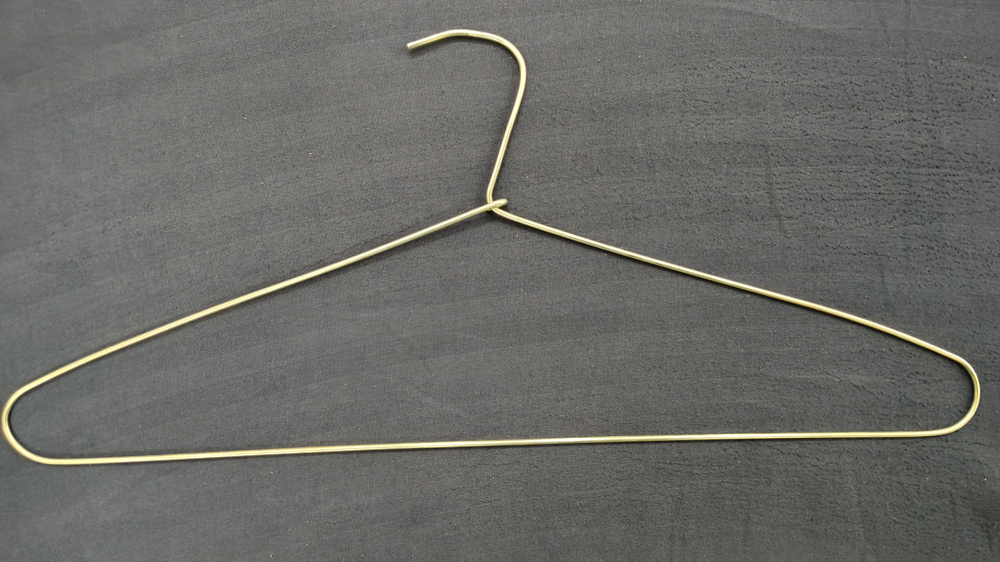

> The hook of the hanger looks weird because I am writing this guide after, first testing out whether the door stopper works (I don't have more hangers to spare 😭😭). 

With these, requirements, you are now ready to build the door stopper.

# Construction of the Door Stopper

## Step 1: Straightening the hook

The very first thing to do, is to straighten the hook as show. THis will help us slide out the loop on the other end easily.

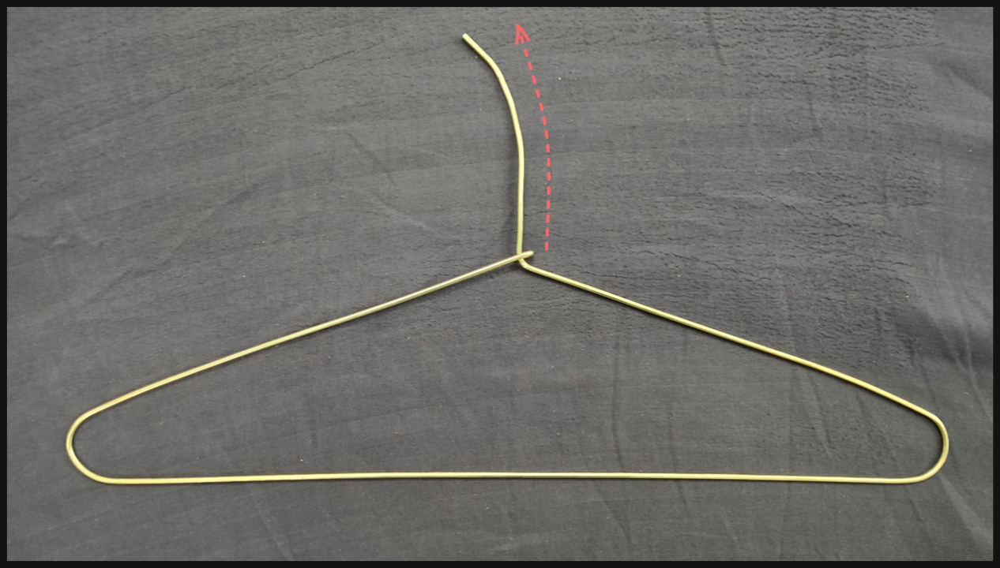

## Step 2: Slide out the loop

Carefully do this step, as you might accidentally bend the loop-end of the hanger out of plane of the rest of the hanger.

| | |
|-- |-- |
| 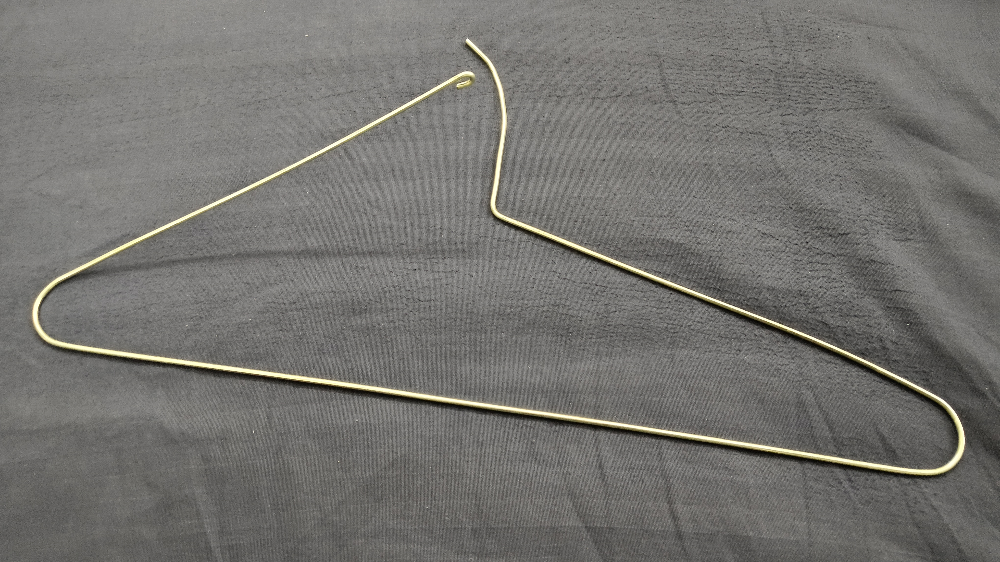 | 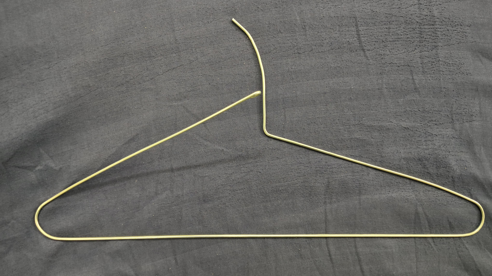 |

## Step 3: Bend the straight end.

Ensure that you bend it away from the loop-end. So that once the lop end latches, it sits at the bottom of the `V` shape.

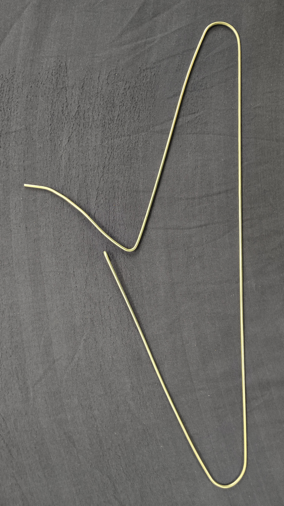

Our door stopper is ready now. Let's see how to use it.

# Latching / Unlatching the door-stopper

## Step 1: Hold the door open.

Make sure the handle of the door and anchor are in close proximity.

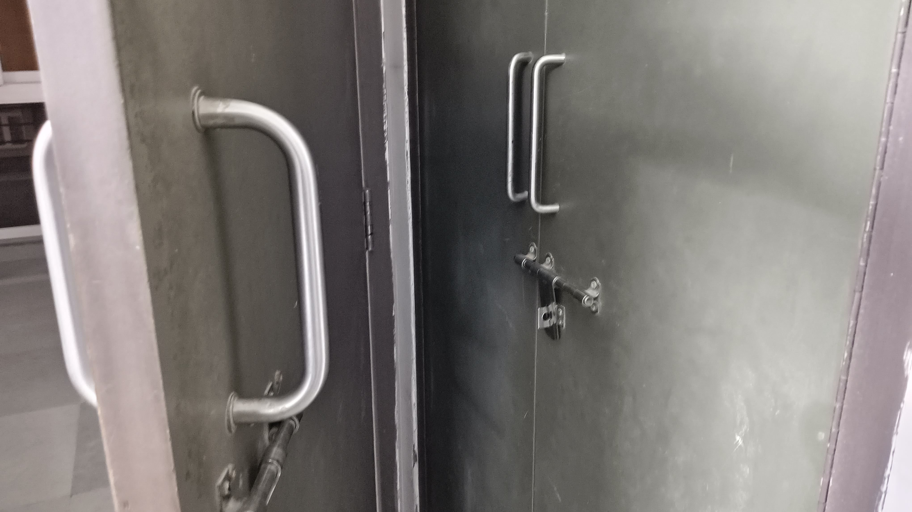

## Step 2: Hang the `V` end onto the anchor

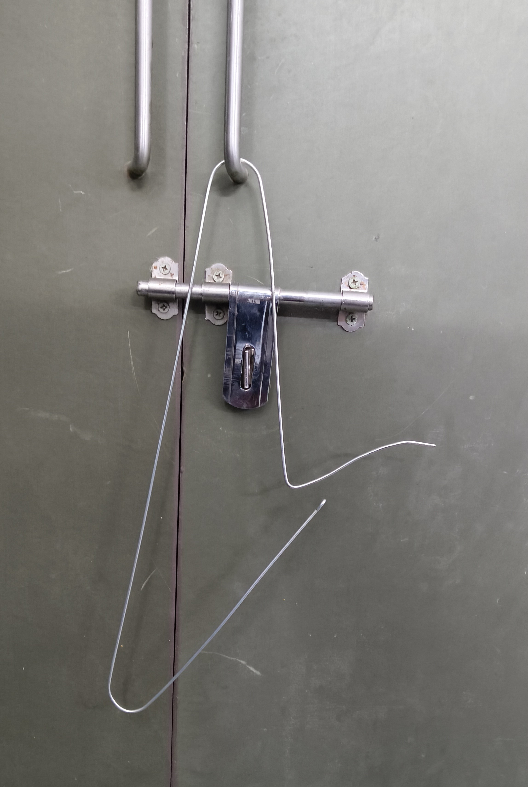

## Step 3: Put the loop-end through door-handle and then latch.

To latch, follow the arrow shown below.

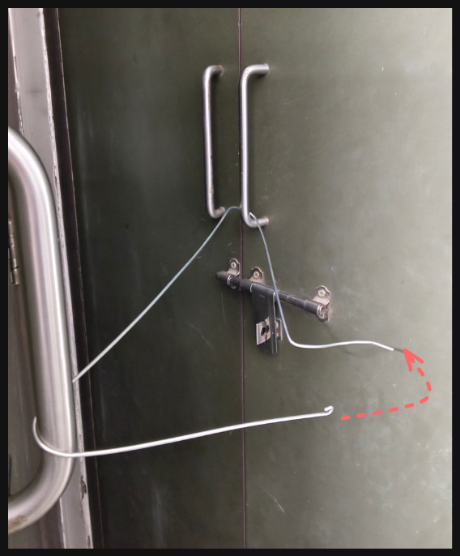

## Final Outcome

The door remains open!!

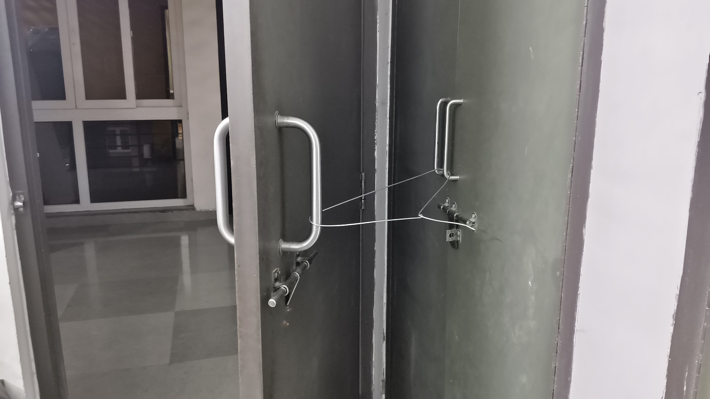

To unlatch, reverse Steps 3 and 2.

# Conclusion

...

